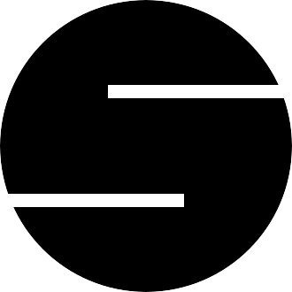

# WIP

## see [TODO](TODO.md) for what is currently cooking!

# AWBot

# Open Sourced under the GPLv3 or later License.

# Key Partners and Sponsors:

 

<h1>

Table of Contents

[AWBot](#awbot)
 
[License](#open-sourced-under-the-gplv3-or-later-license)
 
[Table of Contents](#table-of-contents)
 
[Background](#background)
 
[Tech Stack](#tech-stack)
 
[Github Contributers](#github-contributers)
 
[Star History](#star-history)
 

</h1>

# Background:

    
reasons

There are many reasons for this project, some of them good some of them bad. All of them have to do with the general landscape of Discord right now and the way that Discord is treating *good* developers, and how developers are treating users and what discord is letting *bad* developers get away with.

We (royally) decided that we wanted to make a bot that is able to do everything any other bot can do, even if you were to pitch the idea of having several of them mashed together. There are some exceptions, like even though we impliment some command rate limiting and some command error logging, we will *not* be implimenting logging or Anti Nuke functionalities in this bot in the near future, possible never at all. if you would like the logging we suggest that you use [Sapphire](https://sapphire.xyz/?ref=awbot) if you need Anti Nuke we suggest you use [Wick](https://wickbot.com/?ref=awbot) and we want you to know we love both Xge and Fnaki and wish them nothing but the best

# Tech Stach

Tech Stack TOC

- [AWBot](###awbot)
- [Dashboard](#dashboard)
- [Docs](#docs)
- [API](#api)
- [AI](#ai)
- [AI Tooling](#ai-tooling)
- [CI](#ci)

### AWBot

AWBot is written in Python using a custom version of [Discord.py](https://github.com/awfixers-stuff/discord.py) that is being updated to support the latest versions of python, depenancies, and the discord api. This will allow for it to be faster, slimmer, and more powerful then the commonly used version of the wrapper.

### Dashboard

The dashboard is a Next.js app boostrapped with create-next-app and bun, with the added depenancies of Craft, [components.work](https://components.work) and [shadcn/ui](https://ui.shadcn.com). For security it used Cloudflare Turnsile, better auth and clerk. For billing it uses Clerk and Stripe.

### Docs

the Docs are created and made with [FumaDocs](https://fumadocs.dev) and they are deployed via [Vercel](https://vercel.com/?ref=awbot)

### API

### AI

### AI Tooling

### CI

# Github Contributers

Made with [contrib.rocks](https://contrib.rocks).

# Star History

<picture>
  <source media="(prefers-color-scheme: dark)" srcset="https://api.star-history.com/svg?repos=awfixers-stuff/awbot&type=Date&theme=dark" />
  <source media="(prefers-color-scheme: light)" srcset="https://api.star-history.com/svg?repos=awfixers-stuff/awbot&type=Date" />
  
</picture>
